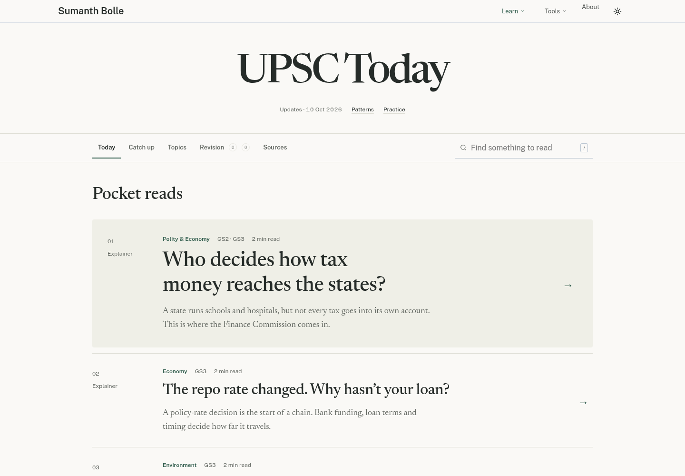
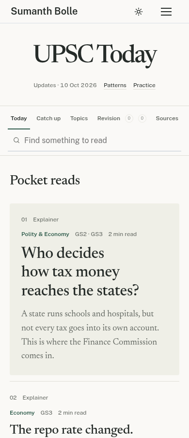
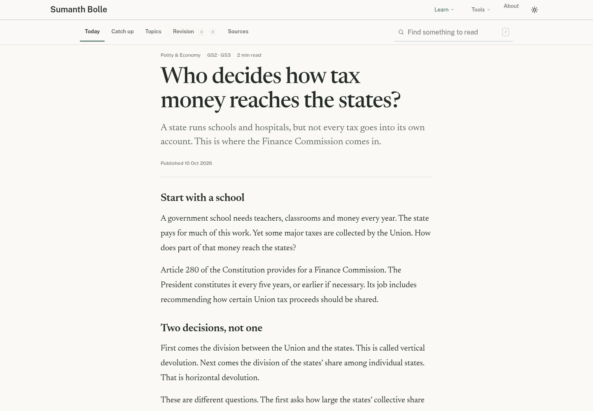
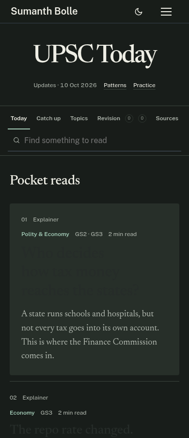
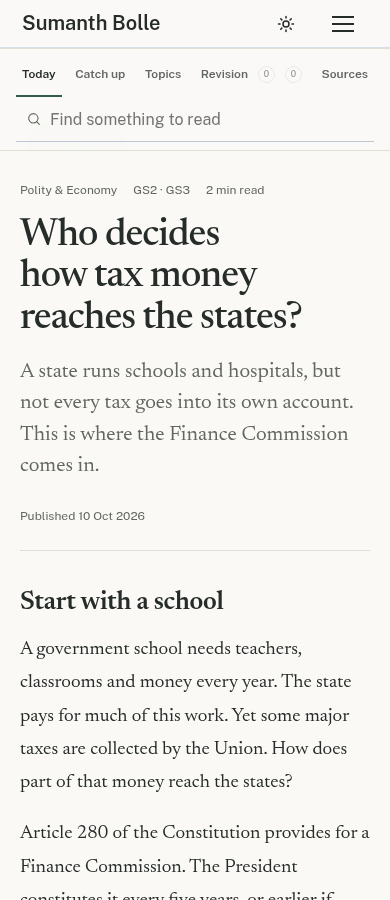
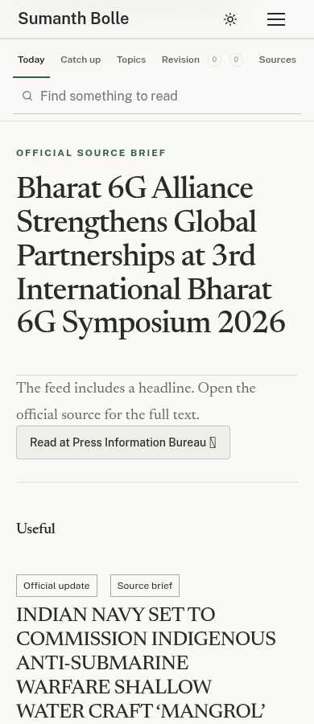

# UPSC Today design preview

Screenshots from the working review branch, captured in Chromium on 10 October 2026. Click an image to view it at full size. These are static previews; the production site is not deployed from this branch.

The page begins with five short articles, followed by a collapsed Study desk and the official update feed. It uses warm paper colours, restrained green accents, self-hosted fonts, and a focused article view. Search, saved takeaways, revision and the source archive remain available. The masthead slogans and repeated priority totals have been removed.

The article renderer now supports the older shared script interface, preventing cached scripts from leaving an empty reader. Asset URLs are versioned, and direct article links focus the loaded title. Pocket reads and Must Know article views share the same reading width, title sizing and responsive spacing.

## Desktop reading room

## Mobile reading room

## Article view

## Mobile dark theme

## Mobile article body

## Must Know source brief

The initial articles are evergreen explainers. The official update feed refreshes through the existing scheduled workflow; Pocket reads need editorial publication. See the [review and daily writing guide](../upsc-reading-review.md).

Validation: all 14 UPSC JavaScript check scripts passed. Browser regression checks cover every article's complete paragraph text and visibility, the older shared renderer interface, direct links and reloads, responsive study articles, search, history and saved takeaways. The deployed domain could not be checked from this environment.
